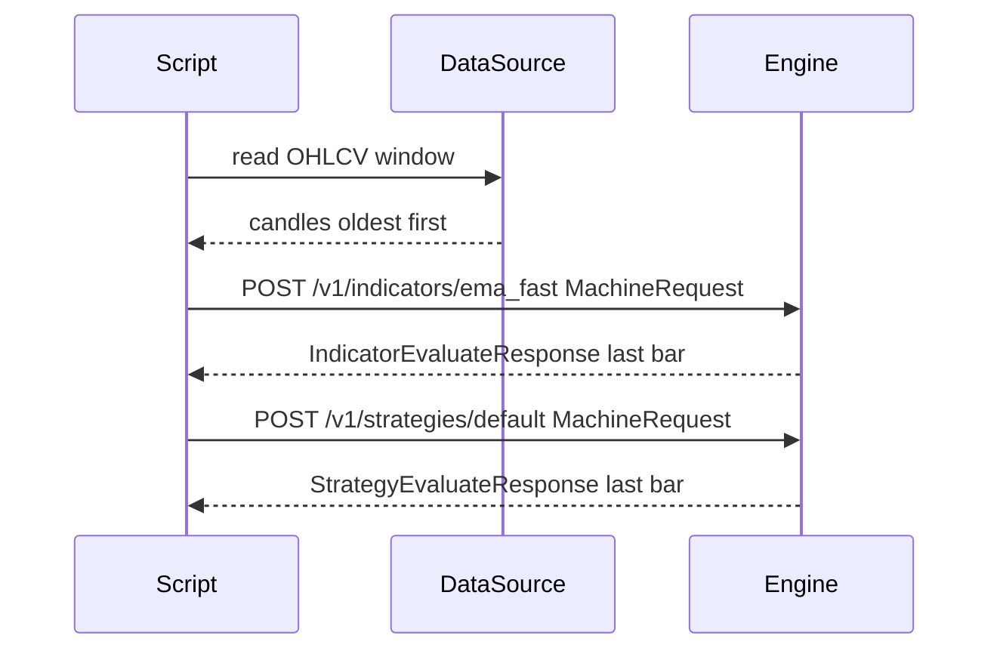
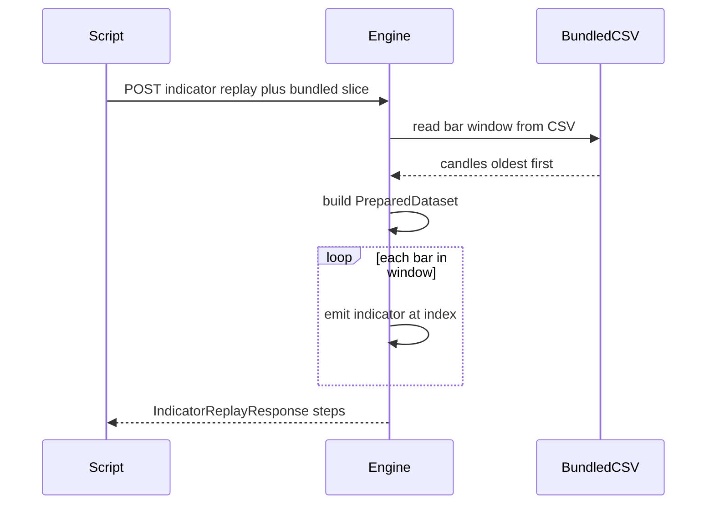

# rust_scalper_engine

An HTTP server that runs closed-bar indicators and strategy evaluation over OHLCV data. Point it at a candle window, get back indicator values or a trading decision on the last bar. Supports single-bar evaluation and full replay (walk-forward over many bars).

Routes: [`src/bin/server.rs`](src/bin/server.rs) — JSON types: [`src/machine.rs`](src/machine.rs)

---

## Quick start

```bash
cargo run
```

Binds to `0.0.0.0:8080` by default. Override with the `HOST` and `PORT` environment variables. No HTTP authentication — bind to `127.0.0.1` or put the service behind a reverse proxy if the port is externally reachable.

```bash
# Shorter volatility warm-up during development
VOL_BASELINE_LOOKBACK_BARS=96 cargo run
```

```bash
cargo test --all-targets --locked
```

---

## API reference

All `/v1/*` responses are JSON. POST bodies are capped at 10 MiB. Errors return `404` (`unknown_indicator` / `unknown_strategy`), `400` (`invalid_request`), or `422` (malformed JSON).

### Catalog

| Method | Path | Response |
|--------|------|----------|
| `GET` | `/health` | Plain text `ok` |
| `GET` | `/v1/capabilities` | `MachineCapabilities` |
| `GET` | `/v1/catalog` | `CatalogResponse` |
| `GET` | `/v1/indicators` | `[CatalogIndicatorEntry]` |
| `GET` | `/v1/indicators/{name}` | `CatalogIndicatorEntry` (404 if unknown) |
| `GET` | `/v1/strategies` | `[CatalogStrategyEntry]` |
| `GET` | `/v1/strategies/{id}` | `CatalogStrategyEntry` (404 if unknown) |

### Evaluation (last bar)

| Method | Path | Body | Response |
|--------|------|------|----------|
| `POST` | `/v1/indicators/{name}` | `MachineRequest` | `IndicatorEvaluateResponse` |
| `POST` | `/v1/strategies/{id}` | `MachineRequest` | `StrategyEvaluateResponse` |

`{name}` is the catalog dot-path (e.g. `ema_fast`). `{id}` matches the `id` field from `/v1/catalog`. Both return a result for the **last bar** in the submitted window.

### Replay (walk-forward)

| Method | Path | Body | Response |
|--------|------|------|----------|
| `POST` | `/v1/indicators/{name}/replay` | `IndicatorReplayRequest` | `IndicatorReplayResponse` |
| `POST` | `/v1/indicators/replay` | `IndicatorReplayRequest` + `indicators` list | `IndicatorReplayResponse` |
| `POST` | `/v1/strategies/replay` | `StrategyReplayRequest` | `StrategyReplayResponse` |

Replay request bodies use the same fields as `MachineRequest`, plus optional `replay_from` / `replay_to` (UTC `YYYY-MM-DD`) to narrow the walk window. When using the path-based endpoint (`/indicators/{name}/replay`), the `indicators` field in the body is ignored — the indicator is set by the URL.

---

## Smoke test

Requires `src/historical_data/btcusd_1-min_data.csv` (or override with the `BTCUSD_1M_CSV` environment variable).

```bash
curl -sS http://127.0.0.1:8080/health

curl -sS -X POST 'http://127.0.0.1:8080/v1/indicators/ema_fast' \
  -H 'Content-Type: application/json' \
  -d '{"bar_interval":"1m","bundled_btcusd_1m":{"from":"2012-01-01","to":"2012-01-02"}}'
```

---

## Integration patterns

There are two ways to feed candle data to the engine.

**Diagrams:** fenced `mermaid` blocks render on the [GitHub README](https://github.com/Freesciencenetwork/rust_scalper_engine/blob/main/README.md). For local Markdown preview in Cursor or VS Code, enable Mermaid (for example the **Markdown Preview Mermaid Support** extension). Plain `text` blocks below are the same flow in ASCII.

---

### Pattern 1 — bring your own candles

Load bars in your own process (from a CSV, database, or exchange API) and include them in the request body as a `candles` array. Do not mix `candles` with `bundled_btcusd_1m` in the same request.



```text
  Script          DataSource          Engine
    |                  |                 |
    |-- read window --->|                 |
    |<- candles -------|                 |
    |-- POST .../indicators/ema_fast -->|
    |<- IndicatorEvaluateResponse -------|
    |-- POST .../strategies/default ---->|
    |<- StrategyEvaluateResponse ---------|
```

Each candle object must have: `close_time` (ms UTC), `open`, `high`, `low`, `close`, `volume`.

```python
import csv, json, os, urllib.request as u
from datetime import date, datetime, timedelta, timezone
from pathlib import Path

ENGINE   = os.environ.get("ENGINE_URL", "http://127.0.0.1:8080").rstrip("/")
csv_path = Path(os.environ.get("BTCUSD_1M_CSV", "src/historical_data/btcusd_1-min_data.csv"))


def utc_range_ms(day_from: str, day_to_inclusive: str) -> tuple[int, int]:
    lo  = date.fromisoformat(day_from)
    hi  = date.fromisoformat(day_to_inclusive) + timedelta(days=1)
    return (
        int(datetime(lo.year, lo.month, lo.day, tzinfo=timezone.utc).timestamp() * 1000),
        int(datetime(hi.year, hi.month, hi.day, tzinfo=timezone.utc).timestamp() * 1000),
    )


def load_btcusd_1m_candles(path: Path, day_from: str, day_to: str) -> list[dict]:
    lo_ms, hi_ms = utc_range_ms(day_from, day_to)
    out: list[dict] = []
    with path.open(newline="") as f:
        r = csv.reader(f)
        header = next(r, None)
        if not header or "timestamp" not in ",".join(h.lower() for h in header):
            raise SystemExit("expected a Timestamp,Open,High,Low,Close,Volume header")
        for row in r:
            if not row or len(row) < 6:
                continue
            ts_ms = int(float(row[0]) * 1000)
            if ts_ms < lo_ms or ts_ms >= hi_ms:
                continue
            o, h, low, c, v = map(float, row[1:6])
            out.append({"close_time": ts_ms, "open": o, "high": h, "low": low, "close": c, "volume": v})
    return out


candles = load_btcusd_1m_candles(csv_path, "2012-01-02", "2012-01-02")
print(f"loaded {len(candles)} bars")

body = {"bar_interval": "1m", "candles": candles}

# Indicator on the last bar
req = u.Request(
    f"{ENGINE}/v1/indicators/ema_fast",
    data=json.dumps(body).encode(),
    headers={"Content-Type": "application/json; charset=utf-8"},
    method="POST",
)
resp = json.loads(u.urlopen(req, timeout=120).read().decode())
print(f"last close={candles[-1]['close']}  ema_fast={resp['value']}")

# Strategy decision on the last bar
req_s = u.Request(
    f"{ENGINE}/v1/strategies/default",
    data=json.dumps(body).encode(),
    headers={"Content-Type": "application/json; charset=utf-8"},
    method="POST",
)
strat = json.loads(u.urlopen(req_s, timeout=120).read().decode())
print("strategy_id:", strat["strategy_id"], "  allowed:", strat["decision"]["allowed"])
```

---

### Pattern 2 — bundled replay (server reads the CSV)

Use this when you want the server to walk forward through the bundled CSV and return a result for every bar in one response. The server builds the dataset once internally and emits a `steps` array.



```text
  Script              Engine                 CSV
    |                    |                    |
    |-- POST replay ---->|                    |
    |                    |-- read window --->|
    |                    |<- candles --------|
    |                    |  build dataset     |
    |                    |  loop bars        |
    |<- steps JSON ------|                    |
```

Set `bundled_btcusd_1m.from` / `to` to UTC `YYYY-MM-DD` to define the loaded slice. Add `replay_from` / `replay_to` if you want to narrow the walk further within that slice.

Each `steps[i]` entry contains `bar_index`, `close_time` (ms UTC), and `indicators["<path>"]`. OHLC prices are not included in the replay payload — join to your own store by time or index if you need them.

```python
import json, os, urllib.request as u

ENGINE = os.environ.get("ENGINE_URL", "http://127.0.0.1:8080").rstrip("/")

body = {
    "bar_interval": "1m",
    "bundled_btcusd_1m": {"from": "2012-01-02", "to": "2012-01-02"},
}
req = u.Request(
    f"{ENGINE}/v1/indicators/ema_fast/replay",
    data=json.dumps(body).encode(),
    headers={"Content-Type": "application/json; charset=utf-8"},
    method="POST",
)
resp = json.loads(u.urlopen(req, timeout=120).read().decode())
print(len(resp["steps"]), "replay steps")
```

To evaluate multiple indicators in one request, use `POST /v1/indicators/replay` with an `indicators` list:

```python
body["indicators"] = ["ema_fast", "atr"]
# POST to /v1/indicators/replay instead of /v1/indicators/ema_fast/replay
```

---

### Pattern 3 — full backtest (`all: true`)

Set `bundled_btcusd_1m.all` to `true` to load the entire CSV and replay from the first bar to the last. Useful for a one-shot linear backtest without specifying date ranges.

```python
import json, os, urllib.request as u

ENGINE = os.environ.get("ENGINE_URL", "http://127.0.0.1:8080").rstrip("/")

body = {
    "bar_interval": "1m",
    "bundled_btcusd_1m": {"all": True},
}
req = u.Request(
    f"{ENGINE}/v1/indicators/ema_fast/replay",
    data=json.dumps(body).encode(),
    headers={"Content-Type": "application/json; charset=utf-8"},
    method="POST",
)
print(u.urlopen(req, timeout=600).read().decode())
```

Do not set `from` or `to` when `all` is `true`.

**Limits:** `all: true` loads at most 500,000 rows from the start of the CSV. Longer files are truncated (see `src/historical_data/mod.rs`). Replay payloads are capped at ~50,000 steps; longer walks are subsampled server-side (see `src/machine.rs`).

Use `POST /v1/strategies/replay` with the same body shape to walk the strategy instead of indicators.
