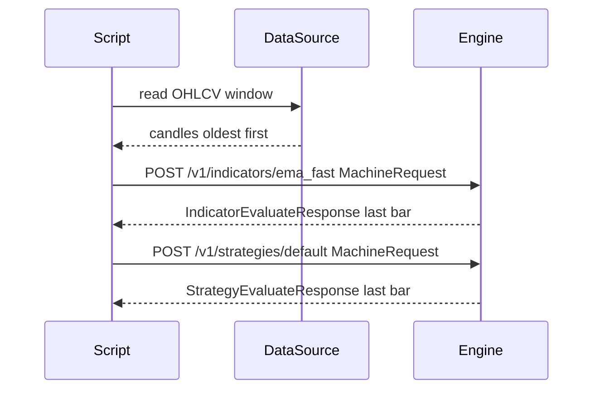
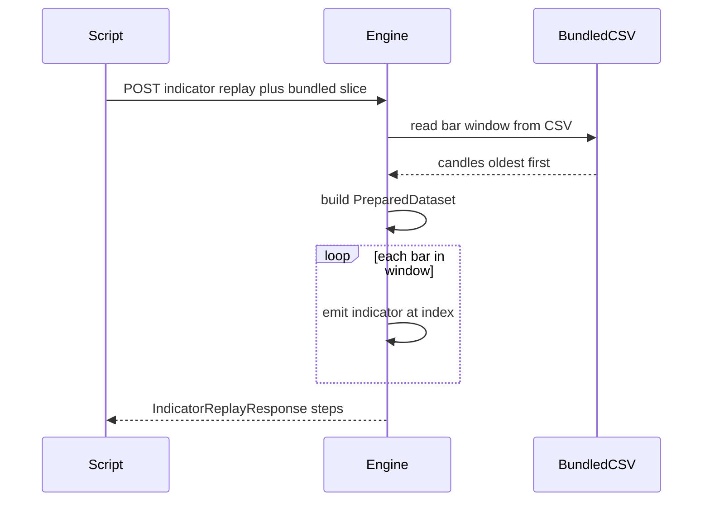

# rust_scalper_engine

This README documents the **Rust HTTP `server`** (default binary): closed-bar indicators, strategy evaluation, replay, and backtest over OHLCV. JSON request and response shapes live in [`src/machine.rs`](src/machine.rs) and [`src/backtest.rs`](src/backtest.rs); routing in [`src/bin/server.rs`](src/bin/server.rs).

Optional repo tooling (Python ML pipeline, example HTTP clients) is **not** covered here — see [`python_pipeline/README.md`](python_pipeline/README.md) and the [`examples/`](examples/) directory.

---

## Indicators and market data (source of truth)

- **Indicators** are implemented and evaluated **only inside this server**. Callers obtain values **only through the HTTP API** (for example `GET /v1/catalog` for paths, `POST /v1/indicators/{name}` for the last bar, `POST /v1/indicators/{name}/replay` for one replay series, and `POST /v1/indicators/replay` with an `indicators` list for several at once).
- **Bundled BTCUSD OHLCV** used by the server lives under [`src/historical_data/`](src/historical_data/) by default (e.g. `btcusd_1-min_data.csv`; the process can override the path with the `BTCUSD_1M_CSV` environment variable). You still **access that series through the API**, not by loading the CSV in parallel for engine-backed workflows: put `bundled_btcusd_1m` on `MachineRequest` / replay bodies (`from` / `to` in UTC `YYYY-MM-DD`, or `all: true`) so the server reads, caps, and optionally resamples the bundle consistently with strategies and backtests.

---

## Quick start

```bash
cargo run
```

Binds to `0.0.0.0:8080` by default. Override with the `HOST` and `PORT` environment variables. No HTTP authentication — bind to `127.0.0.1` or put the service behind a reverse proxy if the port is externally reachable.

```bash
# Shorter volatility warm-up during development
VOL_BASELINE_LOOKBACK_BARS=96 cargo run
```

```bash
cargo test --all-targets --locked
```

---

## API reference

All `/v1/*` responses are JSON. POST bodies are capped at 10 MiB. Errors return `404` (`unknown_indicator` / `unknown_strategy`), `400` (`invalid_request`), or `422` (malformed JSON).

### Catalog

| Method | Path | Response |
|--------|------|----------|
| `GET` | `/health` | Plain text `ok` |
| `GET` | `/v1/capabilities` | `MachineCapabilities` |
| `GET` | `/v1/catalog` | `CatalogResponse` |
| `GET` | `/v1/indicators` | `[CatalogIndicatorEntry]` |
| `GET` | `/v1/indicators/{name}` | `CatalogIndicatorEntry` (404 if unknown) |
| `GET` | `/v1/strategies` | `[CatalogStrategyEntry]` |
| `GET` | `/v1/strategies/{id}` | `CatalogStrategyEntry` (404 if unknown) |

### Evaluation (last bar)

| Method | Path | Body | Response |
|--------|------|------|----------|
| `POST` | `/v1/indicators/{name}` | `MachineRequest` | `IndicatorEvaluateResponse` |
| `POST` | `/v1/strategies/{id}` | `MachineRequest` | `StrategyEvaluateResponse` |

`{name}` is the catalog dot-path (e.g. `ema_fast`). `{id}` matches the `id` field from `/v1/catalog`. Both return a result for the **last bar** in the submitted window.

### Replay (walk-forward)

| Method | Path | Body | Response |
|--------|------|------|----------|
| `POST` | `/v1/indicators/{name}/replay` | `IndicatorReplayRequest` | `IndicatorReplayResponse` |
| `POST` | `/v1/indicators/replay` | `IndicatorReplayRequest` + `indicators` list | `IndicatorReplayResponse` |
| `POST` | `/v1/strategies/replay` | `StrategyReplayRequest` | `StrategyReplayResponse` |

Replay request bodies use the same fields as `MachineRequest`, plus optional `replay_from` / `replay_to` (UTC `YYYY-MM-DD`) to narrow the walk window. When using the path-based endpoint (`/indicators/{name}/replay`), the `indicators` field in the body is ignored — the indicator is set by the URL.

### Backtest (trade ledger)

| Method | Path | Body | Response |
|--------|------|------|----------|
| `POST` | `/v1/strategies/{id}/backtest` | `StrategyBacktestRequest` | `StrategyBacktestResponse` |

`StrategyBacktestRequest` flattens a `MachineRequest` (candles / `bundled_btcusd_1m` / `synthetic_series`) plus optional `from_index` / `to_index`, `replay_from` / `replay_to`, and `execution` (fees, slippage, `max_hold_bars`, etc. — see `src/backtest.rs`).

---

## Smoke test

The server must be able to read `src/historical_data/btcusd_1-min_data.csv` (or override with the `BTCUSD_1M_CSV` environment variable when starting `cargo run`). The smoke `curl` below still goes **through the HTTP API**; the engine loads the bundled file internally when you send `bundled_btcusd_1m`.

```bash
curl -sS http://127.0.0.1:8080/health

curl -sS -X POST 'http://127.0.0.1:8080/v1/indicators/ema_fast' \
  -H 'Content-Type: application/json' \
  -d '{"bar_interval":"1m","bundled_btcusd_1m":{"from":"2012-01-01","to":"2012-01-02"}}'
```

---

## Integration patterns

Each `MachineRequest` must use **exactly one** OHLCV source: non-empty `candles`, `synthetic_series`, or `bundled_btcusd_1m` (validated in `src/machine.rs`).

**Diagrams:** fenced `mermaid` blocks render on the [GitHub README](https://github.com/Freesciencenetwork/rust_scalper_engine/blob/main/README.md). For local Markdown preview in Cursor or VS Code, enable Mermaid (for example the **Markdown Preview Mermaid Support** extension). Plain `text` blocks below are the same flow in ASCII.

---

### Pattern 1 — bring your own candles

Your HTTP client supplies `candles` (oldest first). Do not mix `candles` with `bundled_btcusd_1m` or `synthetic_series` in the same request.



```text
  Script          DataSource          Engine
    |                  |                 |
    |-- read window --->|                 |
    |<- candles -------|                 |
    |-- POST .../indicators/ema_fast -->|
    |<- IndicatorEvaluateResponse -------|
    |-- POST .../strategies/default ---->|
    |<- StrategyEvaluateResponse ---------|
```

Each candle object must have: `close_time` (ms UTC), `open`, `high`, `low`, `close`, `volume`.

Minimal `curl` (two bars); for real windows use a JSON file and `curl ... -d @payload.json`.

```bash
curl -sS -X POST 'http://127.0.0.1:8080/v1/indicators/ema_fast' \
  -H 'Content-Type: application/json' \
  -d '{"bar_interval":"1m","candles":[{"close_time":1700000000000,"open":1,"high":1.1,"low":0.9,"close":1.0,"volume":10},{"close_time":1700000060000,"open":1,"high":1.05,"low":0.95,"close":1.02,"volume":11}]}'
```

For bundled CSV slices without building `candles` yourself, use Pattern 2. For deterministic demo bars without an external file, the server also supports `synthetic_series` (see `SyntheticSeries` in `src/machine.rs`). Example HTTP clients under [`examples/`](examples/) build larger payloads.

---

### Pattern 2 — bundled replay (server reads the CSV)

The server walks the bundled file under `src/historical_data/` (see above) and returns `steps` for each bar. Trigger it only via JSON (`bundled_btcusd_1m`); the server reads the CSV internally.



```text
  Script              Engine                 CSV
    |                    |                    |
    |-- POST replay ---->|                    |
    |                    |-- read window --->|
    |                    |<- candles --------|
    |                    |  build dataset     |
    |                    |  loop bars        |
    |<- steps JSON ------|                    |
```

Set `bundled_btcusd_1m.from` / `to` to UTC `YYYY-MM-DD` for the loaded slice. Add `replay_from` / `replay_to` to narrow the walk inside that slice. Each `steps[i]` has `bar_index`, `close_time` (ms UTC), and `indicators["<path>"]` — no OHLC in the replay payload.

Single indicator:

```bash
curl -sS -X POST 'http://127.0.0.1:8080/v1/indicators/ema_fast/replay' \
  -H 'Content-Type: application/json' \
  -d '{"bar_interval":"1m","bundled_btcusd_1m":{"from":"2012-01-02","to":"2012-01-02"}}'
```

Several indicators in one POST:

```bash
curl -sS -X POST 'http://127.0.0.1:8080/v1/indicators/replay' \
  -H 'Content-Type: application/json' \
  -d '{"bar_interval":"1m","bundled_btcusd_1m":{"from":"2012-01-02","to":"2012-01-02"},"indicators":["ema_fast","atr"]}'
```

---

### Pattern 3 — bundled full slice (`all: true`)

`bundled_btcusd_1m.all: true` loads from the start of the CSV through the row cap (see `src/historical_data/mod.rs`). Do not set `from` / `to` when `all` is true. Use a long client timeout.

```bash
curl -sS --max-time 600 -X POST 'http://127.0.0.1:8080/v1/indicators/ema_fast/replay' \
  -H 'Content-Type: application/json' \
  -d '{"bar_interval":"1m","bundled_btcusd_1m":{"all":true}}'
```

**Limits:** at most **500,000** rows loaded from the CSV; replay responses cap around **50,000** steps with server-side subsampling on longer walks (`src/machine.rs`).

Use `POST /v1/strategies/replay` with the same `MachineRequest` fields to replay strategy decisions instead of indicators.

---

## Repo map (outside this README)

| Path | Contents |
|------|----------|
| [`python_pipeline/README.md`](python_pipeline/README.md) | Optional Python ML / profitability workflow (calls this server over HTTP). |
| [`examples/`](examples/) | Example HTTP clients (`simple_post.py`, `engine_http_client.py`, …). |
