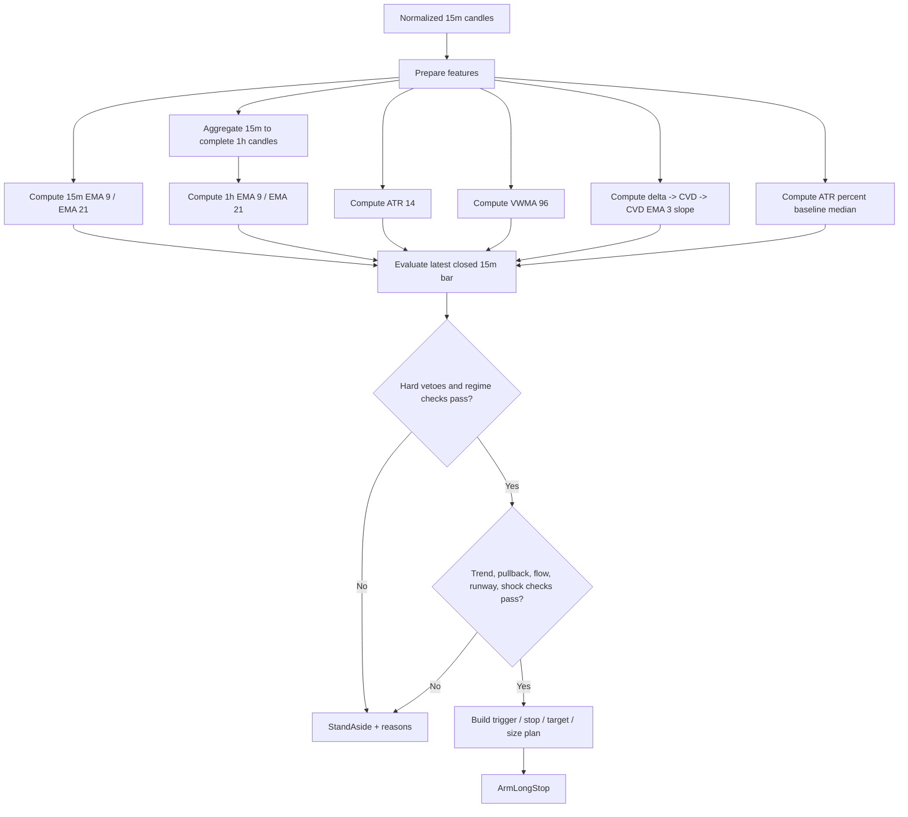
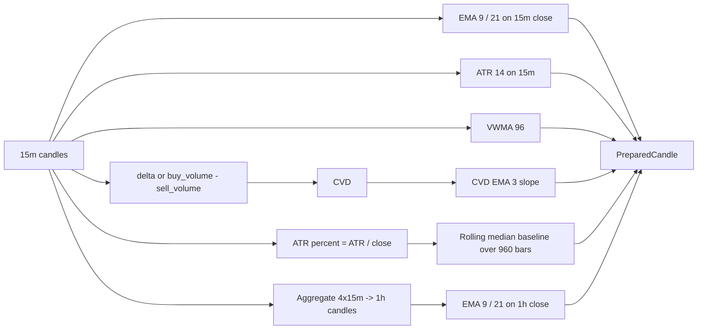
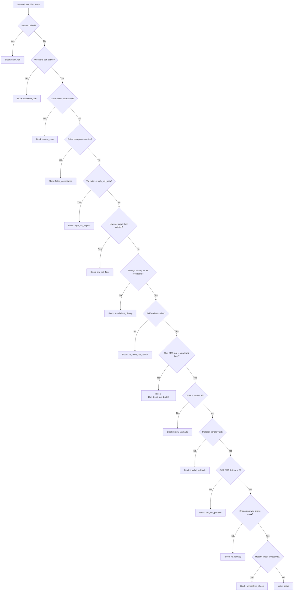
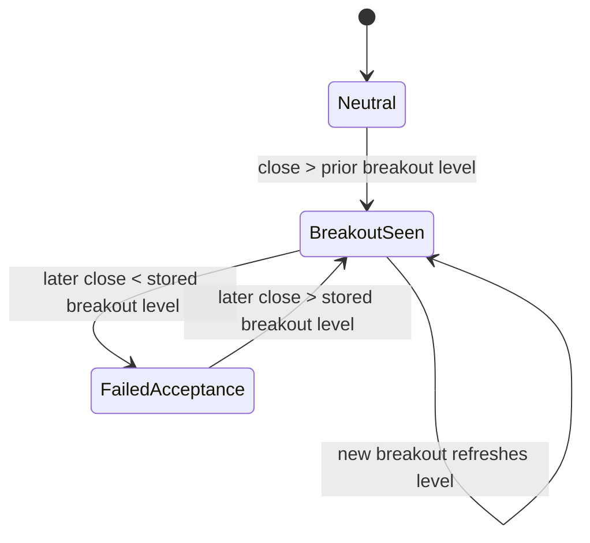

# rust_scalper_engine

## In plain language

This project is a **small engine that reads recent Bitcoin price history** (the kind of “candlestick” summaries exchanges publish) and **tells you whether one specific long-only setup is “on” or “off”** according to a fixed set of rules. You can think of it as a **brain that only answers one question at a time**: “Given what just happened on the chart, does this strategy want to *prepare* for a possible long, or stay out?”

**What you get:** a clear **stand aside** vs **something to consider** style answer, plus reasons and diagnostics your own tools can log or display. Inputs and outputs are ordinary **JSON** so other languages and services can talk to it without digging into Rust first.

**What you do not get:** it does **not** log into an exchange, **place orders**, or **manage risk or money** for you. It is **research and integration software**—useful if you already have (or plan to build) your own way to fetch data and, if you choose, send orders elsewhere.

The rest of this README goes deeper (strategy idea, data shapes, optional demo server, and paper toy runs). **If you only read one technical line**, the summary in the next paragraph is the contract.

> **In one sentence:** a **pure Rust** library that looks at **closed BTC 15m candles** (plus optional context) and answers: *arm a long **stop-entry** intent, or stand aside?* — **JSON in, JSON out**. It does **not** connect to a broker or place orders.

The **Cargo package** name is **`binance_BTC`** (`Cargo.toml`); the **Git repo / folder** name is `rust_scalper_engine`.

## Quick navigation

| I want to… | Jump to |
|------------|---------|
| **Non-technical overview** | [In plain language](#in-plain-language) |
| **Skim what it does and does not do** | [What this is](#what-this-is-and-is-not) (below) |
| **Understand the trading idea** | [Theory of the engine](#theory-of-the-engine) |
| **Integrate (Rust types + JSON)** | [Core boundary](#core-boundary) · [Machine schema](#machine-schema) |
| **Run a quick demo** | [Paper bot](#paper-bot-demo) · [HTTP server](#http-server-optional) |
| **Build a sample `MachineRequest` JSON** | [Binance data CLI](#binance-data-cli-binance-fetch) (`binance-fetch`) |
| **See field shapes / “normalized” rules** | [What “normalized” means](#what-normalized-means) |
| **Repo layout** | [Architecture](#architecture) |

## What this is (and is not)

**This is**

- A **decision engine** (“thinking machine”): normalized inputs → **algorithmic** output (`StandAside` or `ArmLongStop`, reasons, diagnostics, optional position plan hints).
- Built around a **long-only BTC ~15m continuation** strategy (see theory section); other **strategy IDs** can be selected where supported.
- **Embeddable**: use as a Rust **crate**, optional **`server`** HTTP API (Axum), and a small **`paper_bot`** demo that pulls public Binance klines (no API keys) and prints toy paper results.

**This is not**

- A trading **bot**, exchange **connector**, wallet, or live **execution** layer (nothing in `DecisionMachine` sends orders).
- A full **backtest** or walk-forward runner (you bring history; the crate evaluates one snapshot at a time).
- A place for raw exchange blobs: inputs are expected **normalized** (see [What “normalized” means](#what-normalized-means)); use adapters / `binance-fetch` outside the core boundary.

Optional read-only market data: **`binance-fetch`** from [`binance_spot_candles`](https://crates.io/crates/binance_spot_candles) on crates.io (public Spot REST only).

## Core boundary

The public entrypoint is [`src/machine.rs`](src/machine.rs) (`DecisionMachine`).

The canonical JSON contract is under [Machine schema](#machine-schema).

**`DecisionMachine` accepts**

- closed **`15m`** candles (oldest → newest)
- optional macro events, symbol filters, runtime state (e.g. realized **R** today)
- optional RustyFish daily numeric overlay

## Paper bot (demo)

**Use when:** you want to run the engine on **public Binance klines** from your terminal (no HTTP, no API keys) and see a **toy** paper P&L printout.

### Rust `paper_bot` (in-process engine)

Minimal **no-exchange** loop: pulls Binance `15m` klines, runs `DecisionMachine`, prints the decision, and applies a **toy** paper portfolio (fills once on `arm_long_stop` with `qty_btc`, exits when mark closes through `stop_price`). **Not** realistic execution.

```bash
# one snapshot (default needs 1000 klines for vol baseline 960)
cargo run --bin paper_bot

# quick demo: only 96 bars + shorter vol baseline
cargo run --bin paper_bot -- --vol-baseline-lookback-bars 96 --kline-limit 96

# poll every 15 minutes (still paper; uses REST each time)
cargo run --bin paper_bot -- --watch-secs 900
```

## HTTP server (optional)

The **`server`** binary is a thin **Axum** wrapper around `DecisionMachine`: same JSON as the library, **no trade execution**.

- **Run:** `cargo run` (default binary) or `cargo run --bin server`
- **Listen:** `HOST` (IP, default `0.0.0.0`) and **`PORT`** (default `8080`)
- **Logs:** set `RUST_LOG` (e.g. `RUST_LOG=tower_http=trace,binance_BTC=info`)
- **Shorter history (optional):** `VOL_BASELINE_LOOKBACK_BARS` (default `960`). Set to **`96`** so the latest bar only needs **96** closed `15m` candles in each request (looser vol-baseline; fine for dev / smaller payloads). Example: `VOL_BASELINE_LOOKBACK_BARS=96 cargo run`.
- **Horizontal scaling:** Each instance is **stateless** (all bar data and overrides are in the `POST` body; the in-memory `DecisionMachine` is read-only after startup). Run **N** identical replicas behind a load balancer; total throughput scales with **N × per-box hardware** (no sticky sessions). Keep optional env vars (`EVALUATE_API_KEY`, `VOL_BASELINE_LOOKBACK_BARS`, …) aligned across replicas when you use them. **`EVALUATE_MAX_INFLIGHT`** is optional: leave it unset for **no** per-process concurrency cap on evaluate (hardware / OS bound only); set a positive integer to cap concurrent evaluates **per instance** for overload protection.

**You do not wait wall-clock days to “collect” bars:** Binance REST returns **past** klines in one call (e.g. `binance-fetch … --limit 1000` gives ~10 days of `15m` history **immediately**). The default machine config still expects **960** bars in that payload unless you lower `VOL_BASELINE_LOOKBACK_BARS` as above.

| Method | Path | Description |
|--------|------|-------------|
| `GET` | `/health` | Liveness (`ok`) |
| `GET` | `/v1/capabilities` | Same payload as `DecisionMachine::capabilities()` |
| `POST` | `/v1/evaluate` | Body: `MachineRequest` JSON → `MachineResponse` JSON |

**Responses:** malformed JSON → **422**. Evaluation errors (e.g. insufficient history) → **400** with JSON `{"error":"invalid_request"}`. If **`EVALUATE_API_KEY`** is set, missing or wrong credentials → **401** with `{"error":"unauthorized"}` (send key as `X-Api-Key: …` or `Authorization: Bearer …`).

## Binance data CLI (`binance-fetch`)

Read-only **Binance Spot** REST (no API keys). The tool ships with the **[`binance_spot_candles`](https://crates.io/crates/binance_spot_candles)** crate on crates.io.

**Install the CLI once** (puts `binance-fetch` on your `PATH`, usually `~/.cargo/bin`):

```bash
cargo install binance_spot_candles
```

Then run **`binance-fetch`** directly (no `cargo run`, no local folder):

```bash
binance-fetch klines --symbol BTCUSDT --interval 15m --limit 1000 > request.json
binance-fetch symbol-filters --symbol BTCUSDT
```

This repo’s **library** dependency on the same crate is the normal Cargo registry entry in `Cargo.toml` (`binance_spot_candles = "0.1.0"`), not a path to a folder.

**`klines`** — downloads [`GET /api/v3/klines`](https://developers.binance.com/docs/binance-spot-api-docs/rest-api/market-data-endpoints#klinecandlestick-data) and prints a **`MachineRequest` JSON** (minimal fields: `candles_15m` filled, rest empty / null). Pipe or save and merge with `symbol_filters` / `account_equity` before `POST /v1/evaluate` if needed.

- `--symbol` (default `BTCUSDT`), `--interval` (default `15m`), `--limit` (default `1000`, max `1000`)
- `--start-time` / `--end-time` — optional Unix **milliseconds** (`startTime` / `endTime` query params)
- `--base-url` — default `https://api.binance.com`; use e.g. `https://testnet.binance.vision` for the Spot testnet host when applicable

Example (after `cargo install binance_spot_candles`):

```bash
binance-fetch klines --symbol BTCUSDT --interval 15m --limit 1000 > request.json
```

**`symbol-filters`** — fetches `exchangeInfo` and prints **`symbol_filters`** JSON (`tick_size`, `lot_step`) for `--symbol`.

```bash
binance-fetch symbol-filters --symbol BTCUSDT
```

**Publishing:** updates to **`binance_spot_candles`** are published from that crate’s own repository / checkout (`cargo publish` there). This engine crate stays **`publish = false`** — do not `cargo publish` it from this repo unless you intend to.

Library API (`fetch_klines`, `parse_klines_json`, …): see **[docs.rs `binance_spot_candles`](https://docs.rs/binance_spot_candles)**. This crate re-exports them as `binance_BTC::adapters::binance`.

## What “normalized” means

In this repo, `normalized` means the input has already been translated into the
machine’s canonical internal shape before it reaches the decision engine.

That means:

- timestamps are already converted to RFC3339 / UTC-compatible values
- field names already match the machine schema
- numbers are already parsed as numbers, not strings
- semantic categories are already mapped to numeric codes
- candles are already ordered oldest to newest
- candles are already closed bars, not partial live bars
- venue-specific naming has already been mapped to the canonical names
- text reports have already been reduced to a bounded structured overlay

The current machine boundary is stricter than that:

- request payload values should be numeric-only JSON values
- timestamps should be sent as Unix milliseconds
- macro events should be sent as numeric event codes
- runtime booleans should be sent as numeric flags
- RustyFish context should be sent as numeric overlay fields only

Examples of normalized inputs:

- a candle with numeric `close_time`, `open`, `high`, `low`, `close`, `volume`
- a macro event with numeric `event_time` and numeric `class` code
- symbol filters with `tick_size` and `lot_step`
- a RustyFish overlay with numeric fields like `trend_bias`, `chop_bias`,
  `vol_bias`, `conviction`

Examples of non-normalized inputs:

- Binance raw payloads with exchange-specific field names
- CSV rows where prices and volumes are still strings
- timestamps in string or mixed formats that have not been standardized
- free-text news summaries
- human-written RustyFish prose reports
- partial or unsorted candle streams

The rule is:

- messy, raw, exchange-specific, or human-readable data stays outside the
  machine
- only validated machine-shaped data is allowed inside

So the full pipeline should be:

- raw source data
- parser / adapter / LLM interpreter if needed
- validated normalized schema
- `DecisionMachine`

It returns:

- `MachineAction`
- `SignalDecision`
- optional `PositionPlan`
- diagnostics including the latest prepared frame and effective config

The machine currently emits only two actions:

- `StandAside`
- `ArmLongStop`

That is deliberate. This crate decides. Something else may execute or ignore the decision.

## Theory of the engine

This engine is a **long-only BTC `15m` continuation filter**. Its theory is not
"predict the future candle in isolation." Its theory is:

1. trend continuation is only worth attempting when higher and lower timeframe
   structure already lean bullish
2. entries should be taken on a controlled pullback-and-reclaim, not on random
   green candles
3. order-flow participation should agree with price structure
4. adverse regimes should be vetoed before any setup is armed
5. risk should be defined from volatility, then rounded to venue constraints

In other words, the engine is trying to answer one narrow question on every
closed `15m` bar:

> "Is this a valid bullish continuation pullback inside an already-bullish
> environment, with enough room to run, without obvious regime or event risk?"

If the answer is yes, it emits a **stop-entry intent** above the signal bar. If
the answer is no, it stands aside and records the blocking reasons.

### The market hypothesis

The underlying hypothesis is:

- BTC tends to produce cleaner continuation entries when the `1h` trend is
  aligned and the `15m` trend is already constructive.
- Good continuation entries usually come from a shallow pullback into dynamic
  support, then reclaim, rather than from chasing extension.
- Price continuation is more reliable when flow is still net supportive.
- Even valid-looking setups degrade sharply during macro windows, weekend
  liquidity distortions, volatility shocks, or when nearby structure leaves no
  reward runway.

This means the engine is deliberately **selective**. It is not an always-in
strategy and it is not a discretionary narrative engine. It is a bounded
yes/no machine that only arms a long stop when multiple independent conditions
agree.

### Core decision flow



### What the engine is actually looking for

The setup is a **bullish continuation pullback**. That phrase has a precise
meaning in this implementation:

- The `1h` trend must already be bullish: `EMA(9) > EMA(21)` on the derived
  `1h` series.
- The `15m` trend must also be bullish for a configurable number of consecutive
  bars: by default the last `3` bars must each satisfy `EMA(9) > EMA(21)`.
- The current `15m` candle must behave like a pullback that was bought:
  its low touches or dips through the fast EMA, but its close finishes back
  above the fast EMA and not below the slow EMA.
- The close must still be above `VWMA(96)`, which acts as a medium-horizon
  participation anchor.
- Flow must confirm through a positive slope in `EMA(3)` of cumulative delta.

That combination means the engine is not buying because price is merely green.
It is buying because:

- higher timeframe structure is bullish
- lower timeframe structure is bullish
- the latest candle tested support and recovered
- volume-weighted context still favors longs
- flow has not rolled over

### Feature preparation theory

The engine first converts raw normalized candles into a richer per-bar feature
frame. Each latest-bar decision is made only after this preparation step.



The prepared frame contains:

- price bar data
- `15m` trend state
- `1h` trend state
- ATR and ATR percent
- a long-horizon volatility baseline
- VWMA context
- CVD momentum

This is important because the engine does **not** mix raw parsing logic with
decision logic. First it computes a stable feature space. Then it evaluates the
decision on that feature space.

### Indicator meaning inside this engine

- `EMA(9)` and `EMA(21)`:
  used as short-vs-medium trend proxies on both `15m` and `1h`.
- `ATR(14)`:
  used as the engine's volatility unit for regime classification, stop
  placement, target placement, and minimum-move filtering.
- `VWMA(96)`:
  used as a participation-aware context line. Being above it means price is not
  just up, but up relative to a longer weighted average of traded activity.
- `CVD EMA(3) slope`:
  a lightweight flow confirmation. Positive slope means net aggressive buying
  pressure is still improving at the margin.
- `ATR / close` and rolling median baseline:
  used to estimate whether current volatility is unusually elevated relative to
  recent history, not just high in absolute price terms.

### Gate stack

The engine is structured as a stack of independent vetoes. Some are "hard risk"
filters and some are "setup quality" filters.



The key design choice is that the engine returns **all blocking reasons that
apply**, not just the first one. That makes the output auditable and useful to
an external orchestrator.

### Hard veto theory

These filters exist because some environments are judged structurally hostile to
this setup class, regardless of how pretty the current candle looks.

#### 1. Daily halt

The machine halts new entries when either:

- `halt_new_entries_flag != 0`
- `realized_net_r_today <= daily_loss_limit_r`

With default config, `daily_loss_limit_r = -2.0`.

Theory: when the system is already stopped by operator intent or has exceeded
its daily loss budget, a new intraday continuation setup should not override
that higher-level risk control.

#### 2. Weekend ban

The weekend window is:

- Friday from `22:00 UTC`
- all Saturday
- Sunday before `22:00 UTC`

Theory: crypto trades 24/7, but this specific continuation model assumes
weekend liquidity and structure are less reliable for clean intraday trend
continuation.

#### 3. Macro veto

Macro events create a no-trade envelope around scheduled releases:

- FOMC rate decision and Powell press conference:
  `30m` before to `240m` after
- CPI, Core CPI, PPI, NFP, Unemployment Rate, Core PCE, GDP Advance:
  `15m` before to `60m` after

Theory: continuation setups are path-dependent and can be invalidated
instantly by scheduled information shocks. The model would rather skip than
pretend its usual intraday structure rules still dominate during those windows.

#### 4. Failed acceptance state

This is the one piece of persistent local market memory in the engine.

The engine scans bar by bar and stores a breakout level:

- when a close exceeds the highest high of the previous
  `breakout_lookback` bars, that level is remembered
- if later price closes back below that stored level, failed acceptance becomes
  active
- if price later closes back above the level, failed acceptance is cleared



Theory: a breakout that cannot hold acceptance often leaves damaged local
auction structure. The model refuses fresh continuation entries until price
reclaims the failed area.

#### 5. High-vol regime

The engine computes:

- `atr_pct = ATR(14) / close`
- `atr_pct_baseline = rolling_median(atr_pct, 960 bars)`
- `vol_ratio = atr_pct / atr_pct_baseline`

If `vol_ratio >= high_vol_ratio`, the regime is `high` and entries are vetoed.
Default threshold: `1.8`.

Theory: the model does not treat all volatility as good. Excess volatility can
mean unstable, whipsaw-prone conditions where continuation entries become less
predictable and stop geometry degrades.

#### 6. Low-vol floor

The engine also blocks the opposite extreme. It computes the theoretical target
move:

`target_move_pct = (target_atr_multiple * ATR) / entry_price`

If that projected move is below `min_target_move_pct`, the setup is blocked.
Defaults:

- `target_atr_multiple = 3.0`
- `min_target_move_pct = 0.0075`

Theory: if volatility is too compressed, there may not be enough expected range
to justify the trade even if trend alignment looks clean.

### Setup-quality gate theory

After hard vetoes clear, the engine checks whether the actual continuation setup
is high quality.

#### 1. History ready

The engine requires enough bars to support the largest lookback among:

- volatility baseline lookback
- VWMA lookback
- runway lookback

With defaults that means at least `960` bars are needed before the engine
considers the full rule set ready.

Theory: partial indicators create false precision. The engine prefers to refuse
evaluation rather than silently downgrade feature quality.

#### 2. Higher timeframe trend

Condition:

- `1h EMA(9) > 1h EMA(21)`

Theory: only take `15m` continuation signals when the broader local structure is
already bullish.

#### 3. Lower timeframe trend persistence

Condition:

- last `trend_confirm_bars` of `15m` each satisfy `EMA(9) > EMA(21)`

Default: `3` bars.

Theory: one bullish crossover is weaker than several consecutive bars of trend
maintenance.

#### 4. Pullback validity

Condition on the latest `15m` bar:

- `low <= EMA_fast_15m`
- `close > EMA_fast_15m`
- `close >= EMA_slow_15m`

Theory: the candle must show a pullback into fast support and a reclaim by the
close. This approximates "dip was bought" behavior without needing more
complex candle taxonomy.

#### 5. Context VWMA filter

Condition:

- `close > VWMA(96)`

Theory: a local bounce below the longer weighted context line is less desirable
than a pullback that occurs while price remains above medium-horizon value.

#### 6. Flow confirmation

Condition:

- `slope(EMA(3, CVD)) > 0`

Theory: price structure is stronger when net aggressive buying pressure is still
improving, not fading.

#### 7. No-runway veto

The engine searches recent candles for local swing highs above the proposed
entry price. A barrier counts when a candle high is higher than the two highs
to its left and at least as high as the next two highs to its right.

If the nearest such barrier above entry is closer than:

`stop_atr_multiple * ATR`

the setup is vetoed.

Default stop multiple: `2.0`.

Theory: if resistance is too close above the trigger, the trade does not have
enough room to justify the risk.

#### 8. Unresolved shock veto

The engine inspects the current and previous bar for a recent bullish breakout
shock:

- candle is bullish
- candle makes a fresh breakout high over the last `breakout_lookback` bars
- candle range is at least `2.5 * ATR` or candle body is at least `1.75 * ATR`

If such a shock exists and the current close is below the midpoint of that
shock candle, the setup is vetoed.

Theory: explosive breakout candles can leave unstable post-shock structure. If
price cannot hold above the midpoint of the impulse, continuation quality is
considered unresolved rather than clean.

### Entry and plan geometry

When a setup passes, the engine does not send a market buy. It creates a
**buy-stop plan** above the signal bar.

```mermaid
flowchart TD
    A[Signal bar high] --> B[entry = round_up(high + tick_size)]
    B --> C[stop = round_down(entry - 2.0 * ATR)]
    B --> D[target = round_up(entry + 3.0 * ATR)]
    C --> E[risk per BTC = entry - stop]
    D --> F[target move pct = 3.0 * ATR / entry]
    E --> G[risk budget = equity * risk_fraction]
    G --> H[qty = floor_to_step(risk budget / risk per BTC)]
```

The default geometric theory is:

- enter only if price proves itself by trading one tick above the signal bar
- place the stop at `2 ATR` below entry
- place the target at `3 ATR` above entry
- size from fractional account risk if equity is supplied

The exact formulas are:

- `trigger_price = round_up(signal_high + tick_size, tick_size)`
- `stop_price = round_down(trigger_price - stop_atr_multiple * ATR, tick_size)`
- `target_price = round_up(trigger_price + target_atr_multiple * ATR, tick_size)`
- `risk_budget_usd = account_equity * risk_fraction`
- `risk_usd_per_btc = trigger_price - stop_price`
- `qty_btc = floor_to_step(risk_budget_usd / risk_usd_per_btc, lot_step)`

This is not portfolio optimization. It is a simple, deterministic volatility
budgeting model so the machine can emit a fully specified action plan.

### Why the action is `ArmLongStop`

The action is intentionally `ArmLongStop`, not `BuyNow`.

Theory:

- the setup is valid only if price continues through the signal bar high
- a stop-entry avoids buying a candle that looked valid at the close but never
  actually expands upward afterward
- execution is kept outside this crate so strategy logic stays auditable and
  venue-agnostic

### What RustyFish may and may not change

RustyFish does not alter the strategy's identity. It only nudges a bounded set
of thresholds through a `ParameterOverlay`.

The current mapped levers are:

- `risk_fraction_multiplier`
- `high_vol_ratio_multiplier`
- `min_target_move_pct_multiplier`

These are clamped before use:

- risk fraction multiplier to `[0.50, 1.00]`
- high-vol ratio multiplier to `[0.85, 1.15]`
- min target move multiplier to `[1.00, 1.40]`

Theory: daily context may make the engine more conservative, but it should not
be allowed to rewrite entry topology, disable hard vetoes, or lever risk above
the base policy.

### One-line summary

The engine's theory is:

- trade only bullish `15m` pullback continuations
- only when `1h` and `15m` structure agree
- only when flow and VWMA context agree
- never through known hostile regimes or event windows
- define the trade in ATR units
- convert that trade into a venue-rounded stop-entry plan
- otherwise do nothing

## Example

```rust
use binance_BTC::{DecisionMachine, MachineRequest, RuntimeState};
use binance_BTC::domain::Candle;
use chrono::{Duration, TimeZone, Utc};

let machine = DecisionMachine::default();
let base_time = Utc.with_ymd_and_hms(2026, 4, 15, 0, 15, 0).single().unwrap();

let candles_15m: Vec<Candle> = (0..96)
    .map(|index| Candle {
        close_time: base_time + Duration::minutes(15 * index as i64),
        open: 100.0 + index as f64 * 0.1,
        high: 101.0 + index as f64 * 0.1,
        low: 99.5 + index as f64 * 0.1,
        close: 100.7 + index as f64 * 0.1,
        volume: 10.0 + index as f64,
        buy_volume: Some(6.0 + index as f64 * 0.1),
        sell_volume: Some(4.0 + index as f64 * 0.1),
        delta: None,
    })
    .collect();

let response = machine.evaluate(MachineRequest {
    candles_15m,
    macro_events: Vec::new(),
    runtime_state: RuntimeState::default(),
    account_equity: Some(100_000.0),
    symbol_filters: None,
    rustyfish_overlay: None,
})?;
```

## Architecture

Where the important pieces live (high level):

| Area | Path | Role |
|------|------|------|
| **Public API** | [`src/machine.rs`](src/machine.rs) | `DecisionMachine::evaluate`, capabilities, JSON-shaped types. |
| **Feature prep** | [`src/market_data/prepare.rs`](src/market_data/prepare.rs) | Builds `PreparedDataset` / `PreparedCandle` + full `IndicatorSnapshot` from candles + config. |
| **Strategies** | [`src/strategies/`](src/strategies/) | Strategy engines (`default`, `rsi_pullback`, …), gates under `strategies/default/gates/`. |
| **Shared decision math** | [`src/strategy/`](src/strategy/) | `SignalDecision`, formulas (`position_sizing`, …), shared state — not the same folder as `strategies/`. |
| **Indicators** | [`src/indicators/`](src/indicators/) | TA series used from `prepare` (one module per study). |
| **Context** | [`src/context/`](src/context/) | Overlay types, policy clamps, RustyFish → numeric overlay mapping. |
| **HTTP / demo** | [`src/bin/server.rs`](src/bin/server.rs), [`src/bin/paper_bot.rs`](src/bin/paper_bot.rs) | Optional Axum server; Binance kline demo loop. |

**External data:** [`binance_spot_candles`](https://crates.io/crates/binance_spot_candles) (Cargo dependency) supplies Binance REST helpers and CLI `binance-fetch`; see [docs.rs](https://docs.rs/binance_spot_candles). This crate re-exports adapters under `binance_BTC::adapters`.

## What was removed

This crate no longer owns:

- backtesting
- trade replay
- PnL accounting
- fees and slippage modeling
- exchange execution
- CLI execution paths
- file-based core inputs

If you want those later, they should live outside this machine as separate modules or services.

## Machine schema

Canonical JSON contract for the BTC continuation decision machine. Use this shape if this crate is wrapped behind an API service.

### Conventions

- Payload format: JSON
- Request payload values: numeric JSON values only
- Timestamps: Unix milliseconds  
  Example: `1776341700000`
- Numbers: JSON numbers, not strings
- Optional fields may be omitted or set to `null`

### Request

Top-level shape:

```json
{
  "candles_15m": [],
  "macro_events": [],
  "runtime_state": {
    "realized_net_r_today": 0.0,
    "halt_new_entries_flag": 0
  },
  "account_equity": 100000.0,
  "symbol_filters": {
    "tick_size": 0.1,
    "lot_step": 0.001
  },
  "rustyfish_overlay": {
    "report_timestamp_ms": 1776297600000,
    "trend_bias": 0.4,
    "chop_bias": 0.2,
    "vol_bias": 0.1,
    "conviction": 0.6
  }
}
```

#### `candles_15m`

Required. Array of closed `15m` candles ordered from oldest to newest.

Each candle:

```json
{
  "close_time": 1776341700000,
  "open": 84125.4,
  "high": 84210.1,
  "low": 84080.0,
  "close": 84198.6,
  "volume": 154.33,
  "buy_volume": 91.12,
  "sell_volume": 63.21,
  "delta": null
}
```

Rules:

- `close_time` must be the close time of the candle, not the open time
- candles must be closed bars only
- candles should be continuous and sorted ascending by `close_time`
- `delta` is optional
- if `delta` is missing, the machine will infer it from `buy_volume - sell_volume`

#### `macro_events`

Optional.

Each event:

```json
{
  "event_time": 1776342600000,
  "class": 1
}
```

Supported `class` codes:

- `1` = CPI
- `2` = Core CPI
- `3` = PPI
- `4` = NFP
- `5` = Unemployment Rate
- `6` = Core PCE
- `7` = GDP Advance
- `8` = FOMC Rate Decision
- `9` = Powell Press Conference

Unknown codes are rejected at deserialization time.

#### `runtime_state`

Optional. If omitted, defaults to:

```json
{
  "realized_net_r_today": 0.0,
  "halt_new_entries_flag": 0
}
```

Fields:

- `realized_net_r_today`  
  Current realized `R` for the day. If it is already below the daily limit, the
  machine will halt new entries.

- `halt_new_entries_flag`  
  Manual hard stop from the orchestrator. Use `0` for false, non-zero for true.

#### `account_equity`

Optional.

If present, the machine will include `risk_budget_usd` and `qty_btc` in the
`PositionPlan`. If absent, it still returns trigger / stop / target / risk
geometry, but leaves capital-based sizing fields as `null`.

#### `symbol_filters`

Optional.

```json
{
  "tick_size": 0.1,
  "lot_step": 0.001
}
```

Use this when the caller wants venue-specific price and size rounding.

#### `rustyfish_overlay`

Optional.

```json
{
  "report_timestamp_ms": 1776297600000,
  "trend_bias": 0.4,
  "chop_bias": 0.2,
  "vol_bias": 0.1,
  "conviction": 0.6
}
```

This is numeric daily context only. It does not create trades. It only skews
bounded strategy parameters before evaluation.

### Response

Top-level shape:

```json
{
  "action": "arm_long_stop",
  "decision": {},
  "plan": {},
  "diagnostics": {}
}
```

#### `action`

One of:

- `stand_aside`
- `arm_long_stop`

This is intent only. It is not an execution command.

#### `decision`

```json
{
  "allowed": true,
  "reasons": [],
  "regime": "normal",
  "trigger_price": 84210.2,
  "atr": 325.4
}
```

Fields:

- `allowed`  
  Final allow/block result on the latest bar

- `reasons`  
  Empty when allowed. When blocked, contains veto/gate labels such as
  `weekend_ban`, `macro_veto`, `high_vol_regime`, `no_runway`

- `regime`  
  `normal` or `high`

- `trigger_price`  
  Calculated stop-entry trigger if a setup is valid

- `atr`  
  ATR value used by the decision logic

#### `plan`

Present only when `decision.allowed = true`.

```json
{
  "trigger_price": 84210.2,
  "stop_price": 83559.4,
  "target_price": 85186.4,
  "target_move_pct": 0.01159,
  "risk_fraction": 0.005,
  "risk_budget_usd": 500.0,
  "risk_usd_per_btc": 650.8,
  "qty_btc": 0.768
}
```

Fields:

- `trigger_price` — Buy-stop trigger
- `stop_price` — ATR-based stop rounded to venue tick size
- `target_price` — ATR-based target rounded to venue tick size
- `target_move_pct` — Expected target move as a decimal fraction
- `risk_fraction` — Effective risk fraction after any overlay
- `risk_budget_usd` — Present only when `account_equity` was supplied
- `risk_usd_per_btc` — Dollar risk per BTC from trigger to stop
- `qty_btc` — Present only when `account_equity` was supplied

#### `diagnostics`

```json
{
  "as_of": 1776341700000,
  "latest_frame": {},
  "effective_config": {},
  "overlay": {}
}
```

Fields:

- `as_of` — Latest closed `15m` bar time used for evaluation
- `latest_frame` — Fully prepared feature frame for the latest candle
- `effective_config` — Final config after symbol filters and RustyFish overlay
- `overlay` — Present only when RustyFish context was provided

### `latest_frame` shape

```json
{
  "candle": {
    "close_time": 1776341700000,
    "open": 84125.4,
    "high": 84210.1,
    "low": 84080.0,
    "close": 84198.6,
    "volume": 154.33,
    "buy_volume": 91.12,
    "sell_volume": 63.21,
    "delta": null
  },
  "ema_fast_15m": 84091.4,
  "ema_slow_15m": 83982.8,
  "ema_fast_1h": 83884.1,
  "ema_slow_1h": 83540.7,
  "vwma_15m": 83920.3,
  "atr_15m": 325.4,
  "atr_pct": 0.00386,
  "atr_pct_baseline": 0.00242,
  "vol_ratio": 1.59,
  "cvd_ema3": 224.7,
  "cvd_ema3_slope": 18.9
}
```

All indicator fields may be `null` if history is insufficient.

### `effective_config` shape

```json
{
  "vol_baseline_lookback_bars": 960,
  "high_vol_ratio": 1.8,
  "daily_loss_limit_r": -2.0,
  "risk_fraction": 0.005,
  "min_target_move_pct": 0.0075,
  "tick_size": 0.1,
  "lot_step": 0.001,
  "ema_fast_period": 9,
  "ema_slow_period": 21,
  "atr_period": 14,
  "vwma_lookback": 96,
  "trend_confirm_bars": 3,
  "breakout_lookback": 20,
  "runway_lookback": 40,
  "stop_atr_multiple": 2.0,
  "target_atr_multiple": 3.0,
  "low_vol_enabled": true
}
```

### `overlay` shape

```json
{
  "source_code": 1,
  "report_timestamp_ms": 1776297600000,
  "risk_fraction_multiplier": 0.91,
  "high_vol_ratio_multiplier": 0.98,
  "min_target_move_pct_multiplier": 1.08
}
```

### Capabilities response

If you expose `DecisionMachine::capabilities()` through an API endpoint, the
JSON shape is:

```json
{
  "machine_name": "binance_BTC_machine",
  "machine_version": "0.1.0",
  "execution_enabled": false,
  "supported_actions": [
    "stand_aside",
    "arm_long_stop"
  ],
  "accepted_inputs": [
    "normalized_15m_candles",
    "macro_events_numeric",
    "symbol_filters",
    "runtime_state_numeric",
    "rustyfish_overlay_numeric"
  ]
}
```

## RustyFish daily context pipeline

How a `RustyFish` daily vibe report can be piped into the BTC continuation machine without letting it rewrite the strategy.

### Design rule

`RustyFish` is a sidecar context engine, not the core trading engine.

It is allowed to:

- skew a small, approved set of parameters
- reduce risk
- make vetoes easier to trigger
- make low-quality conditions stricter

It is not allowed to:

- create trades by itself
- disable hard vetoes
- remove the weekend ban
- flip the strategy from long-only to shorting
- replace the core entry logic
- replace the stop/target model

### Machine boundary

The machine is split into three layers:

1. **Core strategy** — The canonical `v1` rules, indicators, gates, state machine, and action-plan model.
2. **Context overlay** — A bounded parameter overlay built from a RustyFish daily report.
3. **Exchange adapter** — Binance today, other venues later. Exchange code normalizes market data and metadata into internal types.

### Data flow

```text
RustyFish report JSON
        |
        v
context/rustyfish/io.rs
        |
        v
context/rustyfish/mapper.rs
        |
        v
context/overlay.rs   ->  bounded ParameterOverlay
        |
        v
context/policy.rs    ->  apply_overlay_to_config(base_config, overlay)
        |
        v
StrategyConfig used by the decision machine
```

### Current implemented path

The current crate already supports:

- parsing a RustyFish daily JSON payload
- mapping that report into a normalized `ParameterOverlay`
- applying that overlay to a `StrategyConfig`
- passing the adjusted config into the decision machine

The intended caller flow is now:

```text
external orchestrator -> parse JSON payload -> RustyFishDailyReport -> overlay -> machine config
```

### Current RustyFish report contract

The current JSON shape is:

```json
{
  "report_date": "2026-04-15",
  "trend_bias": 0.4,
  "chop_bias": 0.7,
  "vol_bias": 0.3,
  "conviction": 0.6,
  "summary": "risk-on trend but still choppy"
}
```

Field meaning:

- `trend_bias` — Range `[-1, 1]`. Positive means trend conditions are favorable.
- `chop_bias` — Range `[-1, 1]`. Positive means choppy / low-quality continuation conditions.
- `vol_bias` — Range `[-1, 1]`. Positive means stressed / unstable volatility.
- `conviction` — Range `[-1, 1]`. Higher means stronger confidence in the daily directional environment.
- `summary` — Human-readable rationale for audit and debugging.

### Mapping policy

The current mapping is intentionally small:

- `risk_fraction_multiplier`
- `high_vol_ratio_multiplier`
- `min_target_move_pct_multiplier`

This means RustyFish can currently influence:

1. position risk
2. how easily the system classifies conditions as high-vol
3. how strict the low-vol floor becomes

It cannot change:

- entry formula
- stop multiple
- target multiple
- time stop
- hard veto topology

### Clamp policy

All RustyFish influence is clamped before it reaches the machine:

- `risk_fraction_multiplier` clamped to `[0.50, 1.00]`
- `high_vol_ratio_multiplier` clamped to `[0.85, 1.15]`
- `min_target_move_pct_multiplier` clamped to `[1.00, 1.40]`

Interpretation:

- RustyFish can make the machine more conservative
- RustyFish cannot turn the machine into a different strategy
- RustyFish cannot lever the system beyond the base `v1` risk policy

### Why this pipe is correct

This architecture preserves:

- strategy identity
- auditability
- modularity
- exchange independence

If Binance is replaced tomorrow, the RustyFish pipe does not change because it
is upstream of venue-specific input normalization and downstream of report
generation.

### Recommended daily runtime sequence

For live or paper trading:

1. `00:00-06:00 UTC` — RustyFish crunches overnight news, flow, and regime context.
2. RustyFish writes one report: `reports/rustyfish/YYYY-MM-DD.json`
3. The decision orchestrator loads: base strategy config, exchange metadata, latest RustyFish report.
4. The machine applies the overlay once for the trading day.
5. All decisions for that day log: base config, overlay values, report date, report summary.

### Recommended future extension

The next clean step is a stricter trait boundary:

```text
trait ContextOverlayAdapter {
    fn load_overlay(&self, as_of_date: NaiveDate) -> Result<ParameterOverlay>;
}
```

Then:

- `RustyFishOverlayAdapter` becomes one implementation
- a future news model or macro model can become another
- the engine still consumes only `ParameterOverlay`

### Final recommendation

Use RustyFish as a bounded daily context overlay.

- Do not put RustyFish in the intraday signal loop.
- Do not let RustyFish change the strategy structure.
- Do let RustyFish make the machine more selective when daily conditions are bad.
