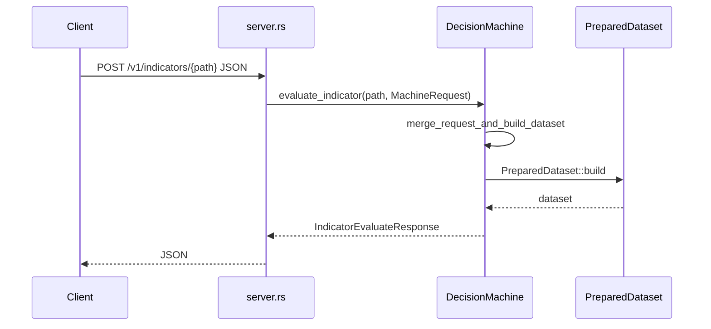
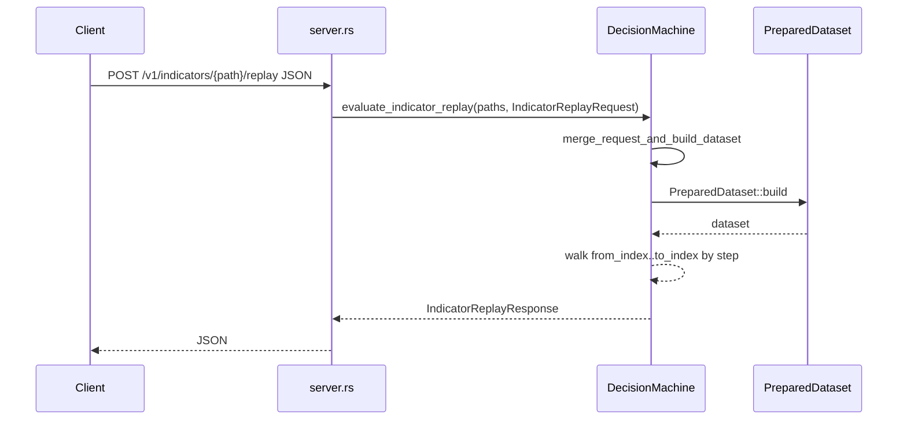

# rust_scalper_engine

Decision support for **closed-bar** technical analysis: one Rust library builds a rich [`PreparedDataset`](src/market_data/) from OHLCV, an optional **HTTP server** exposes **discovery**, **indicator** compute/replay, and **linear strategy replay** — all **stateless** JSON, **no HTTP authentication** (run locally or behind your own proxy).

**Not included:** order routing, accounts, or live exchange feeds. Strategy output is **intent** (`stand_aside`, `arm_long_stop`, …), not executed trades.

---

## Quick start

```bash
cargo run
# → http://0.0.0.0:8080  (override with HOST / PORT)
```

| Variable | Role |
|----------|------|
| `HOST` | Bind address (default `0.0.0.0`) |
| `PORT` | TCP port (default `8080`) |
| `VOL_BASELINE_LOOKBACK_BARS` | Shorter vol warmup in dev (e.g. `96`) |
| `EVALUATE_MAX_INFLIGHT` | Optional per-process cap on concurrent indicator + strategy replay POSTs |
| `BTCUSD_1M_CSV` | Override path to bundled **`btcusd_1-min_data.csv`** (default: `src/historical_data/…` under the crate root) |

POST bodies are limited to **10 MiB** JSON.

---

## HTTP API (summary)

All JSON responses use `Content-Type: application/json` except **`GET /health`** (plain `ok`).

| Method | Path | Body | Notes |
|--------|------|------|--------|
| GET | `/health` | — | Liveness |
| GET | `/v1/capabilities` | — | Name, version, `accepted_inputs`, `supported_actions` |
| GET | `/v1/catalog` | — | Strategies + indicators + `indicator_paths` |
| GET | `/v1/indicators` | — | Same indicator list as catalog |
| GET | `/v1/indicators/{path}` | — | One leaf metadata; **404** `unknown_indicator` |
| GET | `/v1/strategies` | — | Strategy ids + descriptions |
| GET | `/v1/strategies/{id}` | — | **404** `unknown_strategy` |
| POST | `/v1/indicators/{path}` | [`MachineRequest`](#request-body-machinejson) | Last-bar value for one catalog path |
| POST | `/v1/indicators/{path}/replay` | Same + `from_index`? `to_index`? `step`? | One indicator over indices |
| POST | `/v1/indicators/replay` | Same + **`indicators`** array | Multi-path replay |
| POST | `/v1/strategies/replay` | Same + optional index window | [`StrategyReplayResponse`](src/machine.rs); **≤ 50 000** steps |

`{path}` must match **`GET /v1/catalog`** exactly (e.g. `ema_fast`, `indicator_snapshot.momentum.rsi_14`).

### Curl one-liners

```bash
curl -sS http://127.0.0.1:8080/v1/catalog | head
curl -sS -X POST 'http://127.0.0.1:8080/v1/indicators/ema_fast' \
  -H 'Content-Type: application/json' -d @src/historical_data/request.json
```

Paths like **`src/historical_data/request.json`** are relative to the **crate root** (run **`curl`** / **`binance-fetch`** from there).

Load candles with **`binance-fetch`** from the same **[`binance_spot_candles`](https://crates.io/crates/binance_spot_candles)** crate this engine uses (see below). Upstream JSON may use the key **`candles_15m`** — that name is **historical** (it does **not** mean the bars are 15m); timeframe is **`bar_interval`**. This engine treats **`candles_15m`** as an alias for **`candles`**.

**Replay POSTs** use the **same JSON** as last-bar requests (full [`MachineRequest`](#request-body-machinejson)) plus optional **`from_index`**, **`to_index`**, **`step`** on the same object. **`POST /v1/indicators/replay`** also requires a non-empty **`indicators`** array.

```bash
BASE=http://127.0.0.1:8080
curl -sS -X POST "$BASE/v1/indicators/ema_fast/replay" -H 'Content-Type: application/json' -d @src/historical_data/request.json
curl -sS -X POST "$BASE/v1/indicators/replay" -H 'Content-Type: application/json' -d @src/historical_data/request.json
curl -sS -X POST "$BASE/v1/strategies/replay" -H 'Content-Type: application/json' -d @src/historical_data/request.json
```

---

## Request body (`MachineRequest`)

Types live in [`src/machine.rs`](src/machine.rs). Every POST above uses the **same root object** (replay routes add fields on the same JSON object).

### Where do the bars come from?

Pick **exactly one** of: non-empty **`candles`**, **`bundled_btcusd_1m`**, or **`synthetic_series`**.

**A — Your series**

```json
{
  "candles": [ … ],
  "bar_interval": "15m"
}
```

**B — Bundled BTC/USD 1-minute CSV** (not in git: place the file under [`src/historical_data/btcusd_1-min_data.csv`](src/historical_data/) or set **`BTCUSD_1M_CSV`** to its path). Dates are **UTC calendar days** `YYYY-MM-DD`; **`to`** is inclusive through end of that day.

```json
{
  "bar_interval": "1m",
  "bundled_btcusd_1m": {
    "from": "2012-01-01",
    "to": "2012-01-31"
  }
}
```

| `bundled_btcusd_1m` | Meaning |
|---------------------|--------|
| `from` | Optional lower day (inclusive). Omit to start at first CSV row (unless `all` is set). |
| `to` | Optional upper day (**inclusive**). Omit to read through end of file. |
| `all` | If **`true`**, load from first row of the file (do not set **`from`**/**`to`**). |

Hard cap: **500 000** rows per request — narrow **`from`**/**`to`** if you hit it. Full multi-year 1m files exceed that; use a date range or **`step`** on replay.

#### Download candles (Binance — `binance_spot_candles` / `binance-fetch`)

OHLCV comes from the **same dependency** as [`Candle`](src/domain.rs): [`binance_spot_candles`](https://crates.io/crates/binance_spot_candles).

**Full history (paginated, streams to disk)** — uses the crate’s **`fetch_klines`** helper (same code path as **`binance-fetch`**, not a separate HTTP client):

```bash
# from the crate root; writes src/historical_data/request.json (takes a while — millions of 1m bars)
mkdir -p src/historical_data
cargo run --release --bin fetch_max_btcusdt_1m
```

Env overrides: **`BINANCE_BASE_URL`**, **`BINANCE_SYMBOL`**, **`BINANCE_INTERVAL`**, **`BINANCE_START_OPEN_MS`**, **`BINANCE_SLEEP_SEC`**, **`FETCH_OUT`** — see rustdoc on [`src/bin/fetch_max_btcusdt_1m.rs`](src/bin/fetch_max_btcusdt_1m.rs).

**Single call (≤ 1000 bars)** — install the upstream CLI if you only need one page:

```bash
cargo install binance_spot_candles
mkdir -p src/historical_data
binance-fetch klines --symbol BTCUSDT --interval 1m --limit 1000 > src/historical_data/request.json
```

- **Public REST only** (no API key for klines). Optional **`--base-url`** if you use a mirror.
- **Binance caps** each call at **1000** klines. For more than one page, use **`fetch_max_btcusdt_1m`** above, or **`--start-time`** / **`--end-time`** (Unix **milliseconds**, open time) with your own loop around **`binance-fetch`**.
- **`fetch_max_btcusdt_1m`** writes **`candles`** (plus **`bar_interval`**). **`binance-fetch`** still prints **`candles_15m`** — same array, legacy key only.
- Extra keys in the CLI output are **ignored** by serde when posting to this engine. To shrink a **`binance-fetch`** file, for example: `jq '{ candles: (.candles // .candles_15m), bar_interval: (.bar_interval // "1m") }' src/historical_data/request.json > src/historical_data/request.trimmed.json` then **`curl … -d @src/historical_data/request.trimmed.json`**.

[`src/adapters.rs`](src/adapters.rs) re-exports Binance helpers from that crate if you need them in Rust.

#### Bundled 1m CSV (Kaggle — optional)

For **`bundled_btcusd_1m`** (CSV on disk, unix **seconds** in **`Timestamp`**), you can use Python **`kagglehub`** (see [kagglehub](https://github.com/Kaggle/kagglehub)), unzip, then copy/symlink to **`src/historical_data/btcusd_1-min_data.csv`** or set **`BTCUSD_1M_CSV`**. Schema: [`src/historical_data/mod.rs`](src/historical_data/mod.rs).

**C — Synthetic demo bars** (smoke tests without CSV)

```json
{
  "bar_interval": "15m",
  "synthetic_series": { "bar_count": 120 }
}
```

| `synthetic_series` | Meaning |
|--------------------|--------|
| `bar_step_ms` | Optional; ms between closes. If omitted, a parseable **`bar_interval`** is required (e.g. `"15m"` → 900 000). |
| `start_close_ms` | Optional first close (UTC **ms**); default anchor in code. |
| `end_close_ms` | With `start_close_ms`, inclusive range → bar count from step. Ignored if **`bar_count`** is set. |
| `bar_count` | Exact number of bars. If neither `bar_count` nor `end_close_ms`, default **512** bars. |

Hard cap: **500 000** synthetic bars.

### Replay-only fields (same JSON root)

| Field | Applies to | Default |
|-------|----------------|--------|
| `from_index` | indicator + strategy replay | `0` |
| `to_index` | … | last bar (clamped) |
| `step` | … | `1` (use `>1` to thin long histories) |
| `indicators` | **`POST /v1/indicators/replay` only** | — (required non-empty list of paths) |

### Semantics that confuse people once

- **One JSON row = one engine step.** Spacing follows **`close_time`** in **`candles`** or in the bundled CSV; **`bar_interval`** is mainly a **label** (and drives **synthetic** step when `bar_step_ms` is omitted).
- **“Timeframe” for replay** = the series you chose (`candles`, **`bundled_btcusd_1m`** slice, or synthetic length). There is no `start_year` query for bundled data beyond **`from`**/**`to`**.
- **Higher-TF indicator fields** (e.g. `ema_fast_higher`) use config **`higher_tf_factor`** (default **4** base bars per bucket) unless you set **`config_overrides`** — see `ConfigOverrides` in `machine.rs`.

### Optional / advanced keys

Omit unless you need them: **`macro_events`**, **`runtime_state`** (halt / PnL flags for strategy replay), **`account_equity`**, **`symbol_filters`**, **`config_overrides`** (EMA periods, `strategy_id`, VWAP, `higher_tf_factor`, …). **`GET /v1/capabilities`** lists `accepted_inputs` as strings.

### Candle object

Required: **`close_time`** (ms), **`open`**, **`high`**, **`low`**, **`close`**, **`volume`**. Optional: **`buy_volume`**, **`sell_volume`**, **`delta`**. Oldest → newest, **closed** bars only.

---

## HTTP replay (indicator & strategy)

| Route | Extra JSON (same root as `MachineRequest`) | Response |
|--------|--------------------------------|----------|
| **`POST /v1/indicators/{path}/replay`** | Optional **`from_index`**, **`to_index`**, **`step`**. Body **`indicators`** is ignored; path comes from the URL. | [`IndicatorReplayResponse`](src/machine.rs): **`steps`** |
| **`POST /v1/indicators/replay`** | Required non-empty **`indicators`** list; optional index window as above. | Same; each step may include **`unknown_paths`**. |
| **`POST /v1/strategies/replay`** | Optional index window only (no **`indicators`**). | [`StrategyReplayResponse`](src/machine.rs): **`strategy_id`**, **`steps`**. |

**Step cap (replay endpoints):** each replay walk emits at most **50 000** steps (`from_index` … `to_index` with **`step`** ≥ 1). Widen **`step`** or split the date range / candle array if you hit it.

**Dataset row cap:** **`bundled_btcusd_1m`** loads at most **500 000** rows per request (separate from the replay step cap).

---

## Responses (shapes)

**Last bar (`POST /v1/indicators/{path}`)** — [`IndicatorEvaluateResponse`](src/machine.rs):

```json
{
  "path": "ema_fast",
  "value": 84210.5,
  "computable": true,
  "min_bars_required": 9,
  "bars_available": 96
}
```

**Indicator replay** (`…/replay` and `/v1/indicators/replay`) — [`IndicatorReplayResponse`](src/machine.rs):

```json
{
  "steps": [
    {
      "bar_index": 80,
      "close_time": 1744676100000,
      "indicators": {
        "ema_fast": {
          "value": 83900.0,
          "computable": true,
          "min_bars_required": 9,
          "bars_available": 96
        }
      },
      "unknown_paths": []
    }
  ]
}
```

**Strategy replay** (`POST /v1/strategies/replay`) — [`StrategyReplayResponse`](src/machine.rs); each **`decision`** is a [`SignalDecision`](src/strategy/decision.rs) (`allowed`, `reasons`, optional `regime`, `trigger_price`, `atr`, …):

```json
{
  "strategy_id": "default",
  "steps": [
    {
      "bar_index": 100,
      "close_time": 1744676100000,
      "decision": {
        "allowed": false,
        "reasons": ["macro_veto"],
        "regime": "normal",
        "trigger_price": 84200.0,
        "atr": 310.5
      }
    }
  ]
}
```

### Strategy replay semantics

- Walks strategy **`default`** unless **`config_overrides.strategy_id`** selects another registered id.
- Per emitted index **`i`**: strategy is wired, **`runtime_state.halt_new_entries_flag`** applied, **`replay_failed_acceptance_window(0, i, …)`**, then **`decide(i, …)`**.
- **400** + JSON `invalid_request` on bad windows, replay step cap exceeded, or dataset build failure.

**Rust:** [`DecisionMachine::prepare_dataset`](src/machine.rs), [`evaluate_indicator_replay`](src/machine.rs), [`evaluate_strategy_replay`](src/machine.rs), or `strategy_engine_for` + manual `decide` — see [`tests/engine_advice.rs`](tests/engine_advice.rs).

---

## Errors

| Status | Typical cause |
|--------|----------------|
| **400** | Invalid replay window or **50k** step cap; empty `candles` with no **`bundled_btcusd_1m`** / **`synthetic_series`**; more than one data source; bundled CSV / merge errors; bad timestamps |
| **404** | Unknown indicator path or strategy id (GET metadata) |
| **422** | Malformed JSON |

---

## Examples (Python)

| Script | Purpose |
|--------|---------|
| [`examples/simple_post.py`](examples/simple_post.py) | `bundled_btcusd_1m` date range + `POST …/ema_fast` (sets `BTCUSD_1M_CSV` if unset) |
| `cargo run --release --bin fetch_max_btcusdt_1m` | Full Binance history via this repo’s binary calling **`binance_spot_candles::fetch_klines`** → **`src/historical_data/request.json`** |
| `cargo install binance_spot_candles` then `binance-fetch klines …` (≤1000 bars) | One-shot page from the same crate’s published CLI |
| [`examples/engine_http_client.py`](examples/engine_http_client.py) | `--catalog`, indicator POST, `--replay`, `--strategy-replay` |
| [`examples/indicators_replay_date_range.py`](examples/indicators_replay_date_range.py) | Filter `candles` by `close_time`, `POST /v1/indicators/replay` |
| [`examples/replay_request_file.py`](examples/replay_request_file.py) | Explicit replay body (`file` or `bundled` + `from`/`to` or `all`), print request + response |

---

## Library layout

| Path | Responsibility |
|------|----------------|
| [`src/machine.rs`](src/machine.rs) | `MachineRequest`, `DecisionMachine`, merge + dataset, indicator + replay APIs |
| [`src/market_data/`](src/market_data/) | `PreparedDataset`, `PreparedCandle`, `IndicatorSnapshot` |
| [`src/indicators/`](src/indicators/) | TA implementations |
| [`src/strategies/`](src/strategies/) | `Strategy` engines (`strategy_engine_for`) |
| [`src/bin/server.rs`](src/bin/server.rs) | Axum router |

---

## Security note

There is **no API key** on the server. Use **`127.0.0.1`**, a private network, or a reverse proxy with auth if the port is reachable.

---

## Further reading

- [`context/strategy-basis.md`](context/strategy-basis.md) — default strategy story  
- [`context/schema.md`](context/schema.md) — data definitions  
- [`context/indicator-roadmap.md`](context/indicator-roadmap.md) — indicator coverage  

---

## Diagram (HTTP evaluate)





**Summary:** HTTP covers **discovery**, **last-bar indicators**, **indicator replay** (single- and multi-path), **strategy replay**, and **`MachineRequest`** with **`candles`** or **`bundled_btcusd_1m`** or **`synthetic_series`**. This doc matches [`src/bin/server.rs`](src/bin/server.rs) and [`src/machine.rs`](src/machine.rs).
