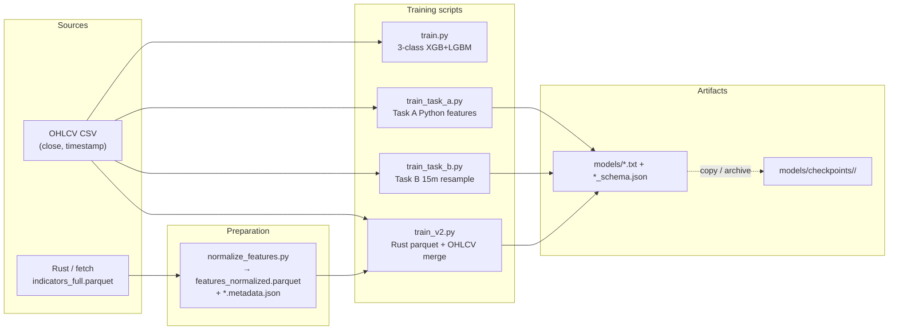
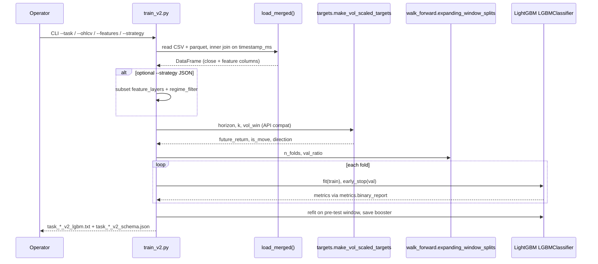
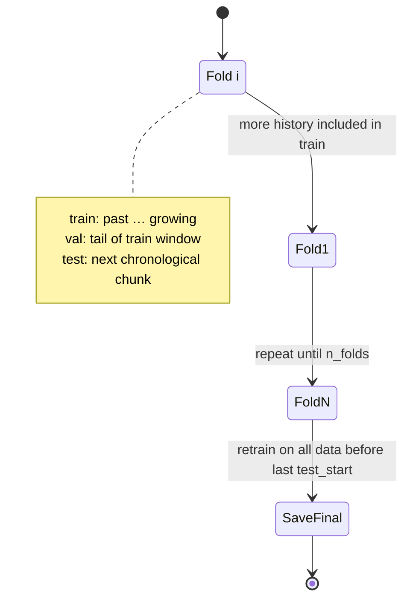
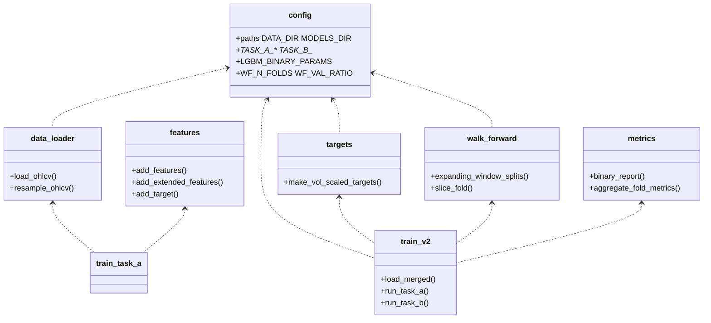

# Python pipeline — features, training, checkpoints

This folder contains the **BTC 1m (and derived)** machine-learning pipeline: feature materialization, **volatility-scaled labels**, **walk-forward** LightGBM training, and **checkpoint** artifacts for the Rust scalper engine.

---

## Quick orientation

| Piece | Role |
|--------|------|
| `data/btc_ohlcv.csv` | Default OHLCV path in `config.py` (override with CLI flags). |
| `data/indicators_full.parquet` | Wide indicator dump (e.g. from Rust / `fetch_indicators.py`). |
| `data/features_normalized.parquet` | Z-scored (etc.) columns keyed by `timestamp_ms` — primary input for `train_v2.py`. |
| `models/` | Default **write** location for `train.py` / `train_task_*.py` / `train_v2.py` (`config.MODELS_DIR`). |
| `models/checkpoints/<run_id>/` | **Frozen** copies of a training run (model `.txt` + `*_schema.json`, sometimes `strategy.json`). |
| `models/checkpoints/RANKING.md` | Human table of checkpoint quality (regenerate with `rank_checkpoints.py`). |
| `models/checkpoints/EVAL_RESULTS.md` | Random-window benchmark notes (regenerate with `evaluate_checkpoints.py`). |

---

## End-to-end data flow (as implemented)



---

## How training works (sequence — `train_v2.py`)

`train_v2.py` is the path aligned with **Rust-normalized** features. It merges OHLCV with the parquet on `timestamp_ms`, builds labels via `targets.make_vol_scaled_targets`, then runs walk-forward folds.



**Task A vs Task B in code**

- **Task A**: every bar; binary **MOVE vs NO_MOVE**; training uses `is_unbalance=True` in `LGBM_BINARY_PARAMS` (`config.py`).
- **Task B**: only rows with `is_move == 1`; binary **UP vs DOWN**; `is_unbalance=False` after filtering.

> **Note:** `train_v2.py` module docstring mentions 15m resampling for Task B; the current `run_task_b` path operates on the **merged 1m** frame (MOVE-filtered). The separate `train_task_b.py` script **does** resample OHLCV to 15m with **Python** features from `features.py`. Use the script that matches how you will serve features in production.

---

## Walk-forward state (one time axis)

Training **never** shuffles bars. `walk_forward.expanding_window_splits` builds an **expanding** train window, a validation tail carved from that train window for early stopping, and a forward test slice.



Constants: `config.WF_N_FOLDS`, `config.WF_VAL_RATIO`.

---

## Module relationships (high level)



---

## Theory: what the models are trained to predict

### Vol-scaled MOVE label (Task A and the MOVE gate for Task B)

Implemented in `targets.py` (training stack):

- Forward return: \(\text{future\_return}[t] = \frac{\text{close}[t+H] - \text{close}[t]}{\text{close}[t]}\).
- Threshold: \(\text{atr\_threshold}[t] = k \times \text{trend\_hist\_vol\_logrets\_20}[t-1]\) (past-only via `shift(1)`).
- **MOVE** if \(|\text{future\_return}[t]| > \text{atr\_threshold}[t]\); else **NO_MOVE**.
- **Direction** (Task B subset): UP `1` / DOWN `0` when MOVE; `NaN` when NO_MOVE (dropped for Task B training).

Intuition: a fixed % threshold would change meaning across decades of BTC prices and volatility regimes; scaling the threshold by a **past** volatility proxy keeps the label semantics closer to “unusual move for *this* moment”.

### Legacy 3-class path (`train.py`)

Uses `features.add_target`: **DOWN / FLAT / UP** from a fixed horizon/threshold on `future_return` (`config.HORIZON`, `config.THRESHOLD`). Trains both XGBoost and LightGBM multiclass; saves the better model to `config.LGBM_MODEL_PATH` / `config.XGB_MODEL_PATH` and `feature_schema.json`.

### Objective and regularization (gradient boosted trees)

- **LightGBM** binary classifiers for Task A/B (`objective: binary`, tree counts / learning rate / `num_leaves` in `config.LGBM_BINARY_PARAMS`).
- **Early stopping** on the walk-forward validation slice (`LGBM_BINARY_EARLY_STOPPING`).
- **Primary offline metric** in scripts: **MCC** (Matthews correlation) plus baseline comparisons (`baselines.py`, `metrics.compare_model_vs_baselines`).

---

## Where models are stored

| Output | Typical path |
|--------|----------------|
| 3-class + schema | `python_pipeline/models/btc_lgbm.txt`, `btc_xgb.json`, `feature_schema.json` |
| Task A/B (Python features) | `python_pipeline/models/task_a_lgbm.txt`, `task_a_schema.json`, `task_b_lgbm.txt`, `task_b_schema.json` |
| Task A/B v2 (Rust features) | `python_pipeline/models/task_a_v2_lgbm.txt`, `task_a_v2_schema.json`, `task_b_v2_lgbm.txt`, `task_b_v2_schema.json` |
| Archived run | `python_pipeline/models/checkpoints/<descriptive_name>_*_YYYYMMDD/` |

Each `*_schema.json` lists **`feature_columns` in exact order** — inference must feed the same columns the booster was trained on.

---

## How to train

From the repo root (adjust paths if your data lives elsewhere).

### Environment

```bash
cd python_pipeline
python3 -m venv .venv && source .venv/bin/activate
pip install -r requirements.txt
# Parquet IO often needs:
pip install pyarrow
```

### 1) Rust-feature pipeline (`train_v2.py`)

Requires `data/features_normalized.parquet` and sibling metadata (`features_normalized.metadata.json`) validated by `validate_feature_provenance()`.

```bash
cd python_pipeline
python3 train_v2.py --task both --n-folds 5
# Fast iteration:
python3 train_v2.py --task a --max-rows 300000
# Subset features / regime gate from a strategy JSON:
python3 train_v2.py --strategy strategies/flowgate_1m_v1.json --ohlcv /path/to/btcusd_1-min_data.csv --features data/features_normalized.parquet
```

Defaults inside `train_v2.py` point `FEATURES_PARQUET` at `data/features_normalized.parquet` and `--ohlcv` at a developer path under `src/historical_data/` — **override `--ohlcv` for your machine**.

**Feature build chain (summary):** `fetch_indicators.py` (or Rust exporter) → `indicators_full.parquet` → `normalize_features.py` → `features_normalized.parquet` (+ metadata).

### 2) Python-indicator tasks (older / standalone)

```bash
cd python_pipeline
python3 train_task_a.py --data data/btc_ohlcv.csv --n-folds 5
python3 train_task_b.py --data data/btc_ohlcv.csv --resample 15min
```

### 3) Legacy 3-class trainer

```bash
cd python_pipeline
python3 train.py --data data/btc_ohlcv.csv --horizon 5 --threshold 0.001
```

---

## How to use a saved model (inference sketch)

1. Load schema JSON → read `feature_columns` (order matters).
2. Build a row vector **with no lookahead** — same engineering as training (for v2: values from `features_normalized.parquet` / live Rust engine).
3. Load LightGBM:

```python
import json
from lightgbm import Booster

schema = json.load(open("models/task_a_v2_schema.json"))
cols = schema["feature_columns"]
bst = Booster(model_file="models/task_a_v2_lgbm.txt")
# X: numpy 2-D float matrix shaped (1, len(cols)) in column order `cols`
proba = bst.predict(X)  # raw scores / probabilities depending on model config
```

4. For **Task A**, threshold `predict` / probabilities for MOVE vs NO_MOVE; for **Task B**, apply **only when** your system considers the bar a MOVE (either model-predicted MOVE or another gate), then predict UP/DOWN.

**Strategy JSONs** under `strategies/` describe how some checkpoints combine Task A/B models in the wider Rust system — see each file’s `feature_layers` and filters.

---

## Results and benchmarking

- **Per-checkpoint summary table:** `models/checkpoints/RANKING.md` — regenerate:

  ```bash
  python3 python_pipeline/models/checkpoints/rank_checkpoints.py
  ```

- **Random historical windows:** `models/checkpoints/EVAL_RESULTS.md` — regenerate:

  ```bash
  python3 python_pipeline/evaluate_checkpoints.py
  ```

> **Evaluation vs training labels:** `evaluate_checkpoints.py` builds its own window labels using **`atr_pct`** and fixed `TASK_A_K` / `TASK_B_K` constants in that file, which can **differ** from `targets.make_vol_scaled_targets` (uses **`trend_hist_vol_logrets_20`** and `config.TASK_*_K`). Treat cross-script numbers as **indicative**, not bit-identical to training labels.

---

## Further reading in-repo

- `FILE_TREE.md` — generated layout of this folder.
- `hypothesis_v3.md` — research notes (if present in your checkout).
- `strategies/*.json` — feature subsets / gates used with specific checkpoints.

---

## References

None (repository-local documentation only).
